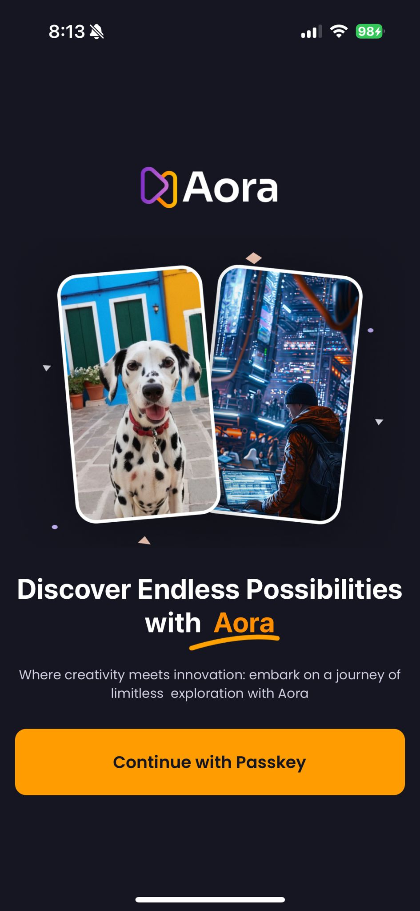
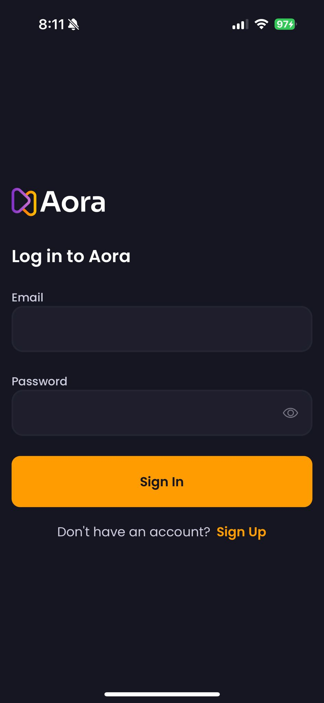
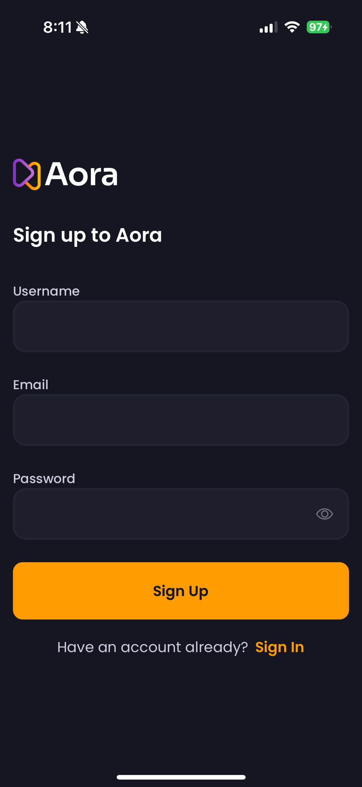
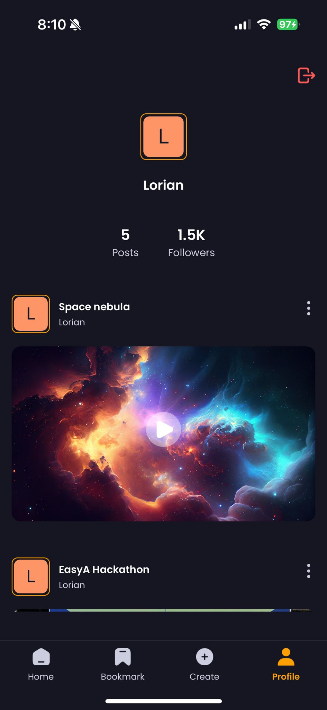
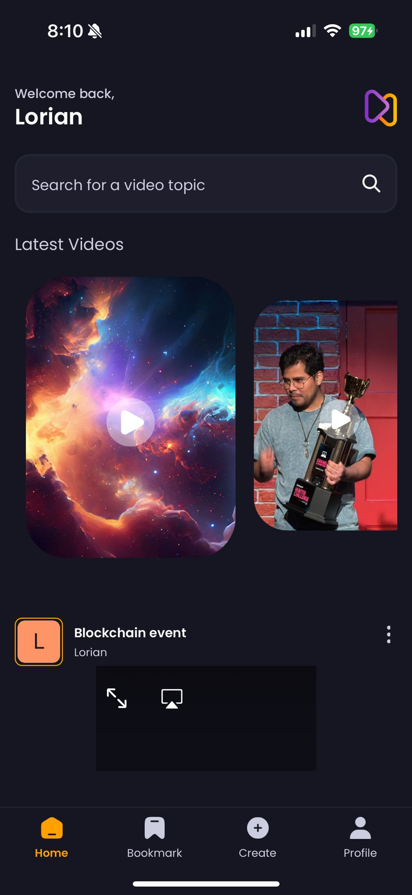

# Aora App

[](https://reactnative.dev/)
[](https://expo.dev/)
[](https://appwrite.io/)

Aora is a mobile application for sharing and discovering AI-generated videos. Built with React Native and powered by Appwrite, this app provides a seamless video sharing experience with an intuitive interface.

## Screenshots
<div align="center">
  <table>
    <tr>
      <td align="center">
        
      </td>
      <td align="center">
        
      </td>
      <td align="center">
        
      </td>
    </tr>
    <tr>
      <td align="center">
        
      </td>
      <td align="center">
        
      </td>
      <td align="center">
        
      </td>
    </tr>
  </table>
</div>

## ✨ Features

- **Video Sharing**: Upload, share, and discover AI-generated videos
- **User Authentication**: Secure sign-up and login functionality 
- **Video Discovery**: Explore trending and latest videos
- **Search Capabilities**: Find videos by title with full-text search
- **User Profiles**: View user-specific video collections
- **Video Playback**: Smooth video playback experience

## 🛠️ Technologies

- **Frontend**: React Native, Expo
- **Backend**: Appwrite
- **Styling**: TailwindCSS (via React Native className syntax)
- **Media**: expo-video, expo-image-picker
- **Navigation**: Expo Router

## 📋 Prerequisites

- Node.js (v16+)
- Expo CLI
- Appwrite account

## 🚀 Getting Started

1. Clone the repository
   ```
   git clone https://github.com/yourusername/aora-app.git
   cd aora-app
   ```

2. Install dependencies
   ```
   npm install
   ```

3. Create an Appwrite project and configure the following:
   - Database with collections for users and videos
   - Storage bucket for video and image files
   - Full-text index on the video title field

4. Update the Appwrite configuration in appwrite.js

5. Start the development server
   ```
   npx expo start
   ```

## 📱 App Structure

- app - Main application screens and navigation
- components - Reusable UI components
- constants - App constants and assets
- lib - Utility functions and API integration
- context - Global state management

## 📄 License

This project is licensed under the MIT License - see the LICENSE file for details.

## 🤝 Contributing

Contributions, issues, and feature requests are welcome! Feel free to check the issues page.

Similar code found with 1 license type